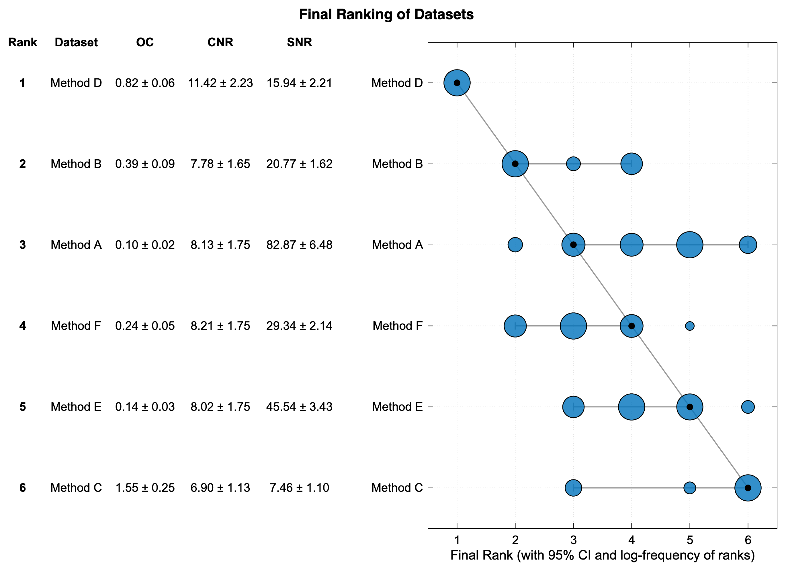
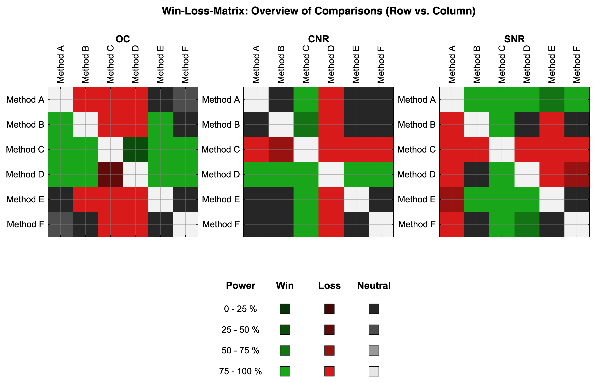
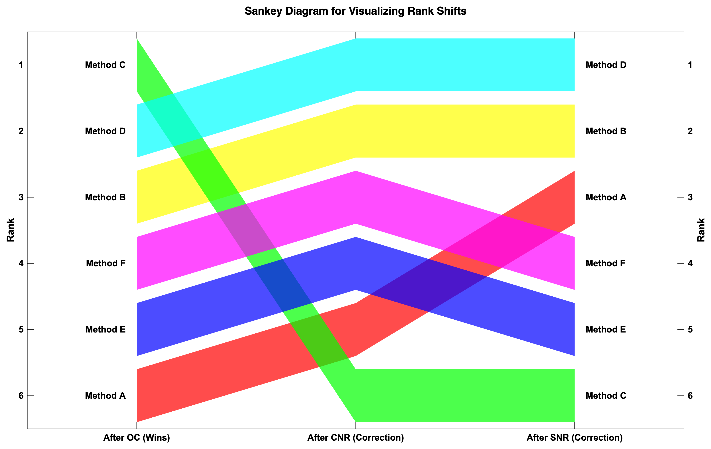

# HERA Example Data

This directory contains synthetic datasets used for testing and validating the HERA toolbox. These datasets are synthetic but based on characteristics of real MRI Images. The original datasets are not included in this repository and results with these will be published in a future paper. As in example for quality metrics to objektively evaluate image quality, we use Optical Contrast (OC), Signal-to-Noise Ratio (SNR) and Contrast-to-Noise Ratio (CNR). These metrics and the way they were calculated and prioritized for the HERA analysis are based on the concept and results of Noeth et al., NMR Biomed. 2015; 28: 818-830.

## Example use case

For this example we have a new Method D to better visualize a specific region of interest (ROI) and compare the results retrospectively to five other imaging methods that can be used as well. We automatically extraced image quality metrics from the images and stored them in the CSV files. We want to select the best possible images for visual quantification in the final study. Looking in to all 6 Methods for 30 patients would be time consuming. Also if our new Method D is not selected as best, we would have to repeat the analysis for all 6 Methods with adapted parameters for Method D. This is why we use HERA to select the best possible three imaging methods for visual quantification in the final study. We prioritize OC first as this is the most important metric for visual quantification and correlated with visual image quality ratings. However CNR should compensate weaker OC as good contrast meens nothing if Noise is high. SNR is priotirized last as we can accept a weaker SNR if the contrast is good. However manipulating OC and CNR while decreasing SNR too much will result in a too low general image quality. Since the scaling of the metrics is not the same, it can be difficult to compare them or prioritize them with specific weights. However we have to make trade-offs between the metrics to get the best possible image quality for the application it is used for.

### Interpreting the results

To give a little guidance on how to interpret the results, we can look at the final report PDF. In our example case Method D is ranked first, Method B second and Method A third. However Method A has a 95 percent confidence interval ranging from rank 3 to rank 6 where as Method F is ranked fourth with a confidence interval of rank 4 to rank 2. When looking into the Sankey Diagramm we see that Method F has its rank due tue its high SNR. When looking into the distribution of the ranks under resampling conditions we see that Method F has more often a higher rank than Method A. When looking into the Win-Loss-Matrix and the csv log file we can understand that Method A could outrank Method F due to its win on SNR against Method E but only with a power of 50 percent. The Sensetivity Analysis shows us that both Method A and F have a comparable Borda Score. It also shows us that our new technique Method D has the highest Borda Score meaning that its high rank is not only due to our selected metric prioritisation. The low score of Method B is mainly driven by the permutations where SNR is prioritized over OC and CNR. For our final analysis we would select Method D as it has the highest stable rank and the highest Borda Score alongside Method B and Method F.

## Example Results

Below are visual outputs generated from the example datasets using HERA.

### Final Ranking

The final ranking of the methods based on the hierarchical-compensatory logic with the confidence interval.

### Win-Loss Matrix

This matrix visualizes the pairwise comparisons between methods. Green indicates a win, red a loss, and gray netrual due to the Threshold criteria not being satisfied.

### Rank Shifts (Sankey Diagram)

This diagram shows how the ranking of methods changes across different metrics or hierarchy levels.

## Directory Structure

- **`examples/`**: Contains synthetic example datasets used for demonstration and testing purposes.
  - `CNR.csv`: Contrast-to-Noise Ratio data.
  - `OC.csv`: Optical Contrast data.
  - `SNR.csv`: Signal-to-Noise Ratio data.

- **`results/`**: Contains results generated by HERA analysis on the synthetic datasets. To generate the results a base model M1 Macbook Pro with 16GB RAM was used.

## Usage

You can use the datasets in `examples/` to run HERA. Please use enough CPU cores to speed up the analysis.
