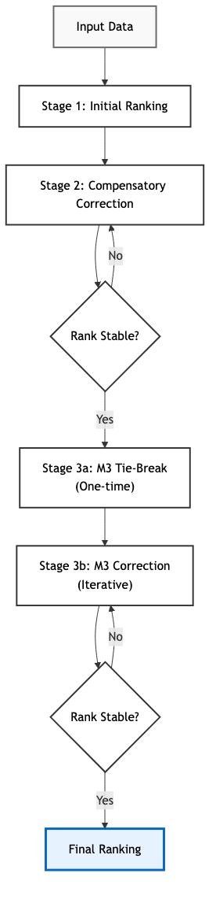
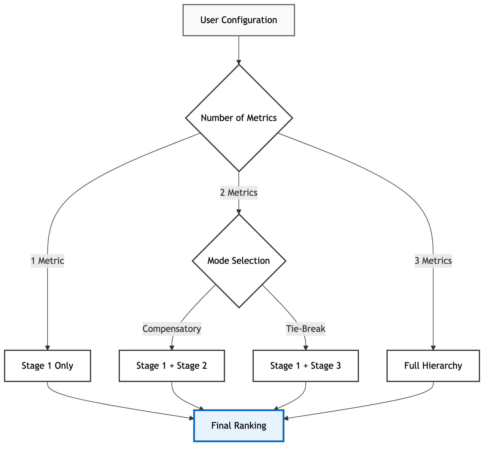

## Summary

In scientific disciplines ranging from clinical research to machine learning, researchers face the challenge of objectively comparing multiple algorithms, experimental conditions, or datasets across a variety of performance metrics. This process, often framed as Multi-Criteria Decision Making (MCDM), is critical for identifying state-of-the-art methods. However, traditional ranking approaches frequently suffer from limitations: they may rely on central tendencies that ignore data variability [@Demsar2006], depend solely on p-values which can be misleading in large samples [@Wasserstein2016], or require subjective weighting of conflicting metrics [@Taherdoost2023].

**HERA** (Hierarchical-Compensatory, Effect-Size Driven Ranking Algorithm) is a MATLAB toolbox designed to automate this comparison process, bridging the gap between elementary statistical tests and complex decision-making frameworks. Unlike weighted-sum approaches that collapse multi-dimensional performance into a single scalar, HERA implements a **hierarchical-compensatory logic**. This logic integrates non-parametric significance testing (Wilcoxon signed-rank test), robust effect size estimation (Cliff's Delta, Relative Difference), and rigorous bootstrapping (Percentile, BCa, Cluster) to produce rankings that are both statistically robust and practically relevant. HERA is designed for researchers in biomedical imaging, machine learning, and applied statistics who need to compare method performance across multiple quality metrics in a statistically rigorous manner without requiring subjective parameter tuning.

## Statement of Need

The scientific community increasingly recognizes the pitfalls of relying on simple summary statistics or p-values alone [@Wasserstein2016]. In benchmarking studies, specifically, several issues persist:

1. **Ignoring Variance**: Ranking based on mean scores fails to account for the stability of performance across different subjects or folds. A method might achieve a high average score due to exceptional performance on a few easy cases while failing catastrophically on others, yet still outrank a more consistent competitor.
2. **Statistical vs. Practical Significance**: A result can be statistically significant but practically irrelevant, especially in large datasets where even trivial differences yield $p < 0.05$. Standard tests do not inherently distinguish between these cases, potentially leading to the adoption of methods that offer no tangible benefit [@Lakens2021].
3. **Subjectivity in Aggregation**: Many MCDM methods require users to assign arbitrary weights to metrics (e.g., "Accuracy is 0.7, Speed is 0.3"). These weights are often chosen post-hoc or lack empirical justification, introducing researcher bias that can be manipulated to favor a specific outcome [@Taherdoost2023].
4. **Distributional Assumptions**: Parametric tests (e.g., t-test) assume normality, which is often violated in real-world benchmarks where performance metrics may be skewed, bounded, or ordinal [@Romano2006].

HERA addresses these challenges by providing a standardized, data-driven framework. It ensures that a method is only ranked higher if it demonstrates a statistically significant and sufficiently large advantage, preventing "wins" based on negligible differences or noise. Unlike existing MCDM software packages such as the Python libraries pyDecision [@Pereira2024] and pymcdm [@Kizielewicz2023], or R's RMCDA [@Najafi2025], which often implement classical methods like TOPSIS, PROMETHEE, and ELECTRE that require user-defined weights or preference functions, HERA eliminates subjective parameterization by using data-driven thresholds derived from bootstrap resampling. Furthermore, HERA integrates statistical hypothesis testing directly into the ranking process, a feature absent in standard MCDM toolboxes. While the MATLAB ecosystem offers robust statistical functions, it currently lacks a dedicated, open-source toolbox that unifies these advanced MCDM methods with rigorous bootstrap validation, often forcing researchers to rely on ad-hoc scripts.

## Methodological Framework

HERA operates on paired data matrices where rows represent subjects (or datasets) and columns represent the methods to be compared. The core innovation is its sequential logic, which allows for "compensation" between metrics based on strict statistical evidence.

### Hierarchical-Compensatory Logic

The ranking process is structured as a multi-stage tournament. It does not use a global score but refines the rank order iteratively:

- **Stage 1 (Initial Sort)**: Methods are initially ranked based on the primary metric \(M_1\). Pairwise comparisons use the Wilcoxon signed-rank test [@Wilcoxon1945], with p-values corrected using the step-down Holm-Bonferroni method [@Holm1979] to control the Family-Wise Error Rate (FWER).
- **Stage 2 (Compensatory Correction)**: This stage addresses the trade-off between metrics. A lower-ranked method can "swap" places with a higher-ranked method if it shows a statistically significant and relevant superiority in a secondary metric \(M_2\). This effectively implements a lexicographic ordering with a compensatory component [@Keeney1976], allowing a method that is slightly worse in the primary metric but vastly superior in a secondary metric to improve its standing, provided the primary deficit is not statistically significant.
- **Stage 3 (Tie-Breaking)**: This stage resolves ambiguity using a tertiary metric \(M_3\). It applies two sub-logics to ensure a total ordering:
  - **Sublogic 3a**: A one-time correction if \(M_2\) is statistically neutral. This handles cases where two methods are indistinguishable in the first two metrics.
  - **Sublogic 3b**: An iterative tie-breaking loop if both \(M_1\) and \(M_2\) are statistically neutral, cycling through remaining metrics until a distinction is found.

### Statistical Rigor and Effect Sizes

HERA quantifies differences using effect sizes to ensure practical relevance independent of sample size [@Cohen1988; @Sullivan2012]. A "win" requires satisfying three conjunctive criteria:

- **Significance**: \(p < \alpha_{\text{Holm}}\) (Holm-Bonferroni corrected).
- **Stochastic Dominance (Cliff's Delta)**: The effect size \(d\) must exceed a bootstrapped threshold \(\theta_d\). Cliff's Delta ($d = P(X>Y) - P(Y>X)$) is robust to outliers and quantifies the degree of overlap between distributions [@Cliff1993].
- **Magnitude (Relative Difference)**: The Relative Difference (RelDiff) must exceed a threshold \(\theta_r\). RelDiff quantifies the magnitude on the metric scale, normalized to the mean absolute value [@Makridakis1993].

**Dual Criteria & SEM Lower Bound**
HERA's complementary logic requires both dominance and magnitude, preventing "wins" based on trivial consistent differences or noisy outliers [@Lakens2013]. Thresholds are determined via Percentile Bootstrapping (lower $\alpha/2$-quantile) [@Rousselet2021]. To filter noise in low-variance datasets, the RelDiff threshold enforces a "Smallest Worthwhile Effect" lower bound derived from the Standard Error of Measurement (SEM) [@Hopkins2004], ensuring $\theta_{r} \geq \theta_{\mathrm{SEM}}$.

### Validation and Uncertainty

HERA integrates advanced resampling methods to quantify uncertainty:

- **BCa Confidence Intervals**: Bias-Corrected and Accelerated (BCa) intervals are calculated for all effect sizes [@DiCiccio1996].
- **Cluster Bootstrap**: To assess the stability of the final ranking, HERA performs a cluster bootstrap resampling subjects with replacement [@Field2007]. This yields a 95% confidence interval for the rank of each method.
- **Power Analysis**: A post-hoc simulation estimates the probability of detecting relevant effects given the data characteristics.
- **Sensitivity Analysis**: The algorithm permutes the metric hierarchy and aggregates the resulting rankings using a Borda Count [@Young1974] to evaluate the robustness of the decision against hierarchy changes.

## Software Features

HERA offers a flexible configuration to adapt to different study designs:

- **Automated Reporting**: Generates PDF reports, Win-Loss Matrices, Sankey Diagrams, and machine-readable JSON/CSV exports.
- **Reproducibility**: Supports fixed-seed execution and configuration file-based workflows. The full analysis state, including random seeds and parameter settings, is saved in a JSON file, allowing other researchers to exactly replicate the ranking results.
- **Convergence Analysis**: To avoid the common pitfall of using an arbitrary number of bootstrap iterations, HERA implements an adaptive algorithm. It automatically monitors the stability of the estimated confidence intervals and effect size thresholds, continuing the resampling process until the estimates converge within a specified tolerance, thus determining the optimal number of iterations \(B\) dynamically.
- **Data Integration**: HERA supports seamless data import from standard formats (CSV, Excel) and MATLAB tables, facilitating integration into existing research pipelines.
- **Accessibility**: HERA can be easily installed by cloning the GitHub repository and running a setup script, or deployed as a standalone application. An interactive wizard guides users through the analysis without requiring programming expertise, while a comprehensive API allows for automated batch processing.

## Future Work

We plan to expand HERA's capabilities in several directions:

- **Python Implementation**: Developing a Python version to reach a broader data science audience.
- **Bayesian Methods**: Incorporating Bayesian approaches for ranking and probability estimation [@Benavoli2016].
- **Independent Samples**: Extending the framework to handle unpaired data (e.g., randomized clinical trials comparing independent groups).

## Acknowledgements

This software was developed at the Institute of Neuroradiology, Goethe University Frankfurt. I acknowledge the contributions of the open-source community for the development of the underlying statistical methods and MATLAB toolboxes that made this project possible.

## References
