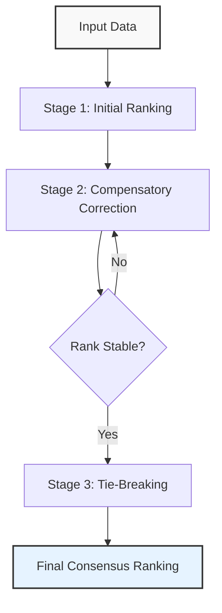
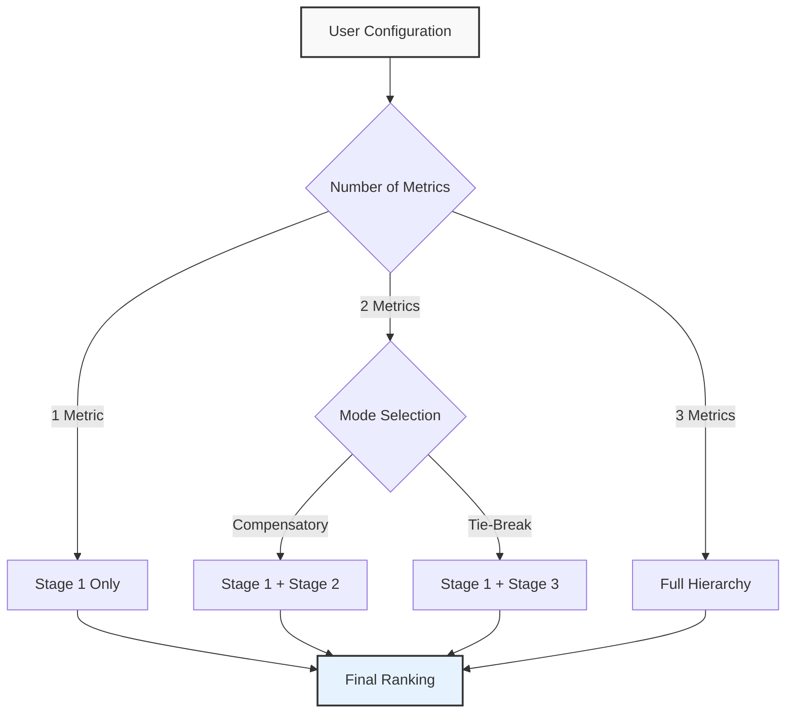

# Summary

In the fields of machine learning, biomedical engineering, and data science, researchers are frequently tasked with comparing multiple algorithms, experimental conditions, or datasets across a variety of performance metrics. This process, often referred to as benchmarking or Multi-Criteria Decision Making (MCDM), is critical for identifying state-of-the-art methods. However, traditional ranking approaches often suffer from significant limitations: they may rely solely on mean values, ignoring data variability; they may depend on p-values, which can be misleading in large samples; or they may require subjective weighting of metrics.

**HERA** (HHierarchical-Compensatory, Effect-Size Driven Ranking Algorithm) is a MATLAB toolbox designed to address these challenges by automating the objective comparison of entities. HERA implements a novel **hierarchical-compensatory logic** that integrates non-parametric significance testing (Wilcoxon signed-rank test), effect size estimation (Cliff's Delta), and rigorous bootstrapping (Percentile and BCa) to produce rankings that are both statistically robust and practically relevant. The toolbox ensures that a method is only ranked higher if it demonstrates a statistically significant and sufficiently large advantage, preventing "wins" based on negligible differences.

# Statement of Need

The scientific community increasingly recognizes the "reproducibility crisis" and the pitfalls of relying on simple summary statistics or p-values alone [@Wasserstein2016]. In benchmarking studies, specifically, several issues persist:
1.  **Ignoring Variance**: Ranking based on mean scores fails to account for the stability of performance across different datasets or subjects [@Demsar2006].
2.  **Statistical vs. Practical Significance**: A result can be statistically significant (low p-value) but practically irrelevant (tiny effect size). Standard tests do not distinguish between these cases [@Lakens2021].
3.  **Subjectivity in MCDM**: Many MCDM methods require users to assign arbitrary weights to different metrics (e.g., "Accuracy is 0.7, Speed is 0.3"), which introduces bias [@Taherdoost2023].
4.  **Lack of Robustness**: Small sample sizes or non-normal distributions can invalidate parametric tests like the t-test [@Romano2006].

HERA fills this gap by providing a standardized, automated, and objective framework. It is particularly valuable for researchers who need to select the "best" method from a pool of candidates based on multiple, potentially conflicting criteria (e.g., maximizing accuracy while minimizing computational cost). By incorporating effect sizes and data-driven thresholds via bootstrapping, HERA offers a more nuanced alternative to traditional ranking schemes like Borda Count [@Young1974] or Nemenyi tests.

# The HERA Algorithm

HERA operates on a matrix of performance data where rows represent subjects (or datasets) and columns represent the methods to be compared. The core innovation is its hierarchical logic, which allows for "compensation" between metrics based on statistical evidence.

## Hierarchical Logic

The ranking process is structured as a multi-stage tournament:



1.  **Stage 1 (Initial Sort)**: Methods are initially ranked based on the primary metric ($M_1$). Pairwise comparisons are performed using the Wilcoxon signed-rank test [@Wilcoxon1945], with p-values corrected for multiple comparisons using the Holm-Bonferroni method [@Holm1979].
2.  **Stage 2 (Compensatory Correction)**: This stage addresses the trade-off between metrics. A lower-ranked method can "swap" places with a higher-ranked method if:
    *   It is not significantly worse in the primary metric ($M_1$) by a "large" margin (defined by an effect size threshold).
    *   It is significantly better in a secondary metric ($M_2$) with a "medium" or "large" effect size.
    This allows, for example, a slightly less accurate but significantly faster algorithm to be ranked higher, provided the accuracy loss is within acceptable limits.
3.  **Stage 3 (Tie-Breaking)**: If two methods are statistically indistinguishable in both $M_1$ and $M_2$, a tertiary metric ($M_3$) is used to break the tie.

## Statistical Rigor

HERA integrates several advanced statistical components:
*   **Effect Sizes**: HERA uses **Cliff's Delta** [@Cliff1993] for ordinal or non-normal data and **Relative Mean Difference** for ratio data. This ensures that rankings reflect the *magnitude* of differences, not just their existence.
*   **Bootstrapping**:
    *   **Percentile Bootstrap**: Used to determine adaptive, data-driven thresholds for "relevance" instead of relying on fixed arbitrary values [@Efron1993].
    *   **BCa Intervals**: Bias-Corrected and Accelerated (BCa) confidence intervals [@DiCiccio1996] are calculated for the final ranks to quantify uncertainty.
    *   **Cluster Bootstrap**: For hierarchical data (e.g., multiple trials per subject), cluster bootstrapping is available to account for dependencies [@Field2007].

# Features

HERA offers a comprehensive suite of features for scientific benchmarking:

*   **Flexible Usage Modes**: Users can configure the algorithm for single-metric ranking, compensatory multi-metric ranking, or strict tie-breaking.

*   **Automated Reporting**: The toolbox automatically generates detailed PDF reports, including:
    *   **Win-Loss Matrices**: Visualizing pairwise comparisons.
    *   **Sankey Diagrams**: Illustrating the flow of ranks across different metrics.
    *   **Convergence Plots**: Showing the stability of bootstrap estimates.
*   **Reproducibility**: All parameters, including random seeds, can be defined in a configuration file (JSON or Struct), ensuring that results can be exactly reproduced.
*   **Interactive Wizard**: A built-in GUI (`HERA.start_ranking()`) guides users through data selection and parameter setting, making the tool accessible to non-programmers.
*   **Missing Data Handling**: HERA supports listwise deletion and mean imputation, providing warnings and logging for transparency [@Little2019].

# Implementation

HERA is implemented in MATLAB and is compatible with MATLAB R2021a and later. It leverages the **Statistics and Machine Learning Toolbox** for core statistical functions and the **Parallel Computing Toolbox** (optional) to accelerate bootstrap iterations.

The codebase follows an object-oriented design pattern:
*   `HERA_Data`: Handles data import, validation, and preprocessing.
*   `HERA_Quantities`: Encapsulates statistical calculations (effect sizes, hypothesis tests).
*   `HERA_Ranking`: Implements the core hierarchical logic and sorting algorithms.
*   `HERA_Report`: Manages the generation of PDF reports and visualization assets.

This modular structure allows for easy extension. For instance, new effect size measures or ranking criteria can be added by subclassing or extending the relevant components.

# Usage Example

HERA can be run in two modes: interactive and batch.

**Interactive Mode**:
```matlab
import HERA.start_ranking
HERA.start_ranking() % Opens the GUI wizard
```

**Batch Mode** (for reproducible scripts):
```matlab
% Define configuration
config.metric_names = {'Accuracy', 'Runtime', 'Memory'};
config.ranking_mode = 'M1_M2_M3'; % Full hierarchy
config.alpha = 0.05;
config.reproducible = true;

% Run HERA
results = HERA.start_ranking('configFile', 'config.json');
```

# Future Work

We plan to expand HERA's capabilities in several directions:
*   **Python Port**: Developing a Python version to reach a broader data science audience.
*   **Bayesian Methods**: Incorporating Bayesian approaches for ranking and probability estimation [@Benavoli2016].
*   **Independent Samples**: Extending the framework to handle unpaired data (e.g., randomized clinical trials comparing independent groups), which presents additional statistical challenges compared to the current paired design.

# Acknowledgements

I acknowledge the support of the Institute of Neuroradiology, Goethe University Frankfurt. I also thank the open-source community for the development of the underlying statistical methods and MATLAB toolboxes that made this project possible.

# References
